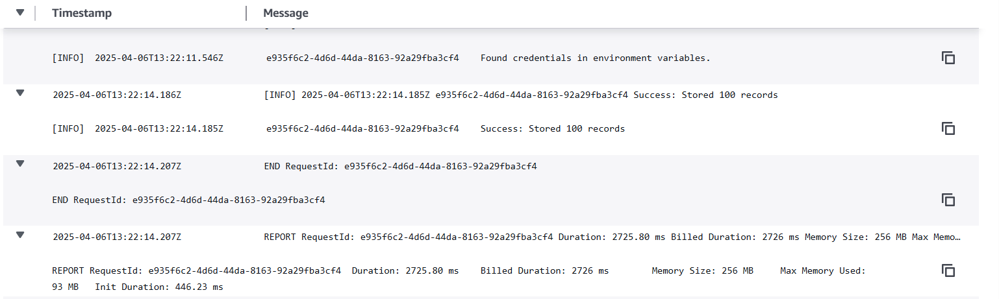
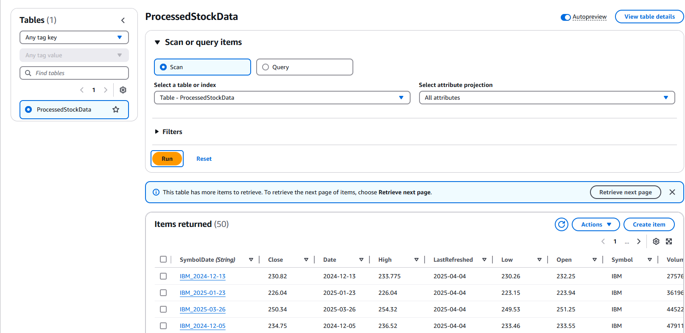
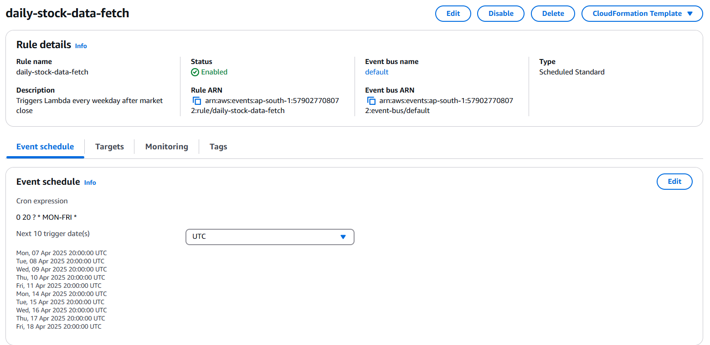
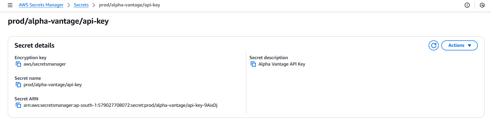

# External-Data-Integration-API-Pipeline

This project demonstrates a fully automated, serverless data integration pipeline that:
- Fetches stock prices from the **Alpha Vantage API**
- Stores the processed data in **AWS DynamoDB**
- Is triggered on a schedule via **AWS EventBridge**
- Uses **AWS Lambda** for data processing
- Secures credentials via **AWS Secrets Manager**

✅ **Successfully meets all functional and non-functional requirements**

---

## ✅ Requirements & Completion

| Task                                                                                   | Status     |
|----------------------------------------------------------------------------------------|------------|
| Fetch data from public API (e.g., stock prices)                                        | ✅ Done     |
| Store retrieved data in AWS (S3, DynamoDB)                                             | ✅ Stored in DynamoDB |
| Automate via Lambda (triggered by EventBridge) or Kubernetes CronJob                  | ✅ Lambda + EventBridge |
| Error handling & secure API key storage (Secrets Manager)                             | ✅ Handled |
| Provide way to verify integration (sample output, logs, or API endpoint)              | ✅ Logs + DynamoDB Items |

---

## ⚙️ Technologies Used

- **Python 3.10**
- **AWS Lambda**
- **AWS EventBridge**
- **AWS DynamoDB**
- **AWS Secrets Manager**
- **Terraform** for IaC

---

## 📂 Project Structure
```bash
├── get-api/
│   ├── get-api.py
│   └── (requests and dependencies folder)
├── terraform/
│   ├── main.tf
│   ├── variables.tf
│   ├── alerts.tf
│   ├── backend.tf
│   ├── iam.tf
│   ├── monitoring.tf
│   ├── secrets.tf
│   ├── state_bucket.tf
│   ├── storage.tf
│   ├── lambda.tf
│   └── eventbridge.tf
└── README.md
```
---

## 🚀 Features

- 🔄 **Automated Trigger**: Scheduled using EventBridge to run Lambda periodically.
- 🔐 **Secure Credentials**: Alpha Vantage API key stored in AWS Secrets Manager.
- ⚙️ **Serverless Processing**: Fast, stateless processing via Lambda.
- 📊 **Structured Storage**: Transformed data stored in DynamoDB with proper schema.

---

## 🛠️ Setup

### 1. Clone this repo and `cd` into it

```bash
git clone <repo-url>
cd terraform
```
# Make sure you define API in terraform.tfvars
```
api_key = "your_api_key"
```

# Deploy the infrastructure
```
terraform init
terraform apply
```
To target a specific IAM update or fix:
```
terraform apply -target=aws_iam_role_policy_attachment.lambda_dynamo
```


--- 

### 📸 Screenshots for Verification

# ✅ Lambda execution success


# ✅ DynamoDB Table


# ✅ EventBridge


# ✅ Cloudwatch Alarms


# ✅ Secrets Manager


---
# Conclusion
Everything’s wired up and running as expected! Feel free to explore the code, logs, and included visuals for a full understanding of how the system works.
